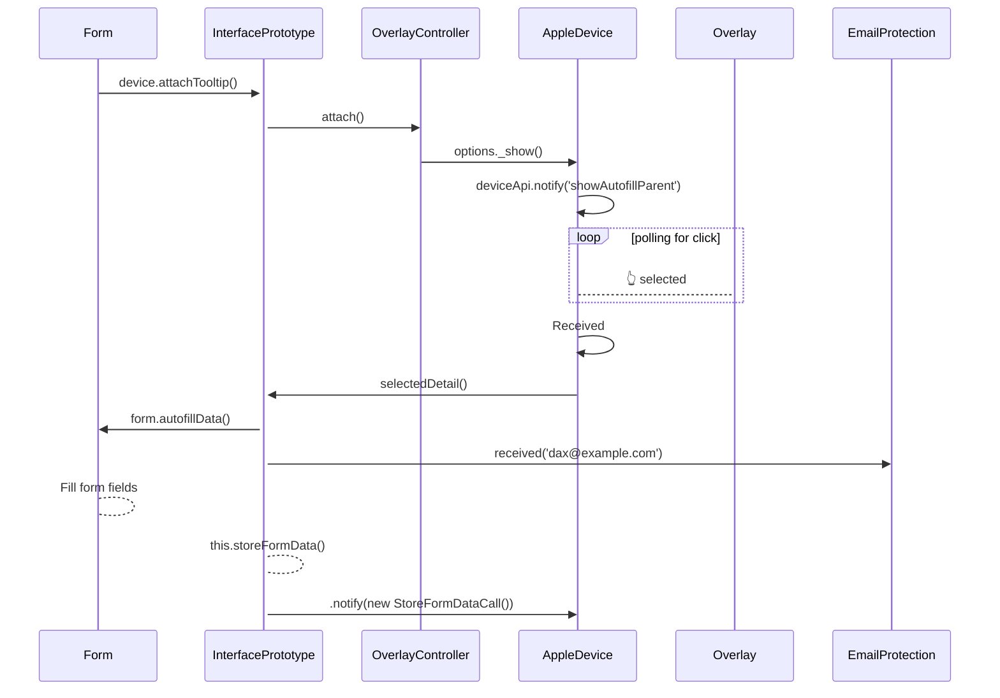
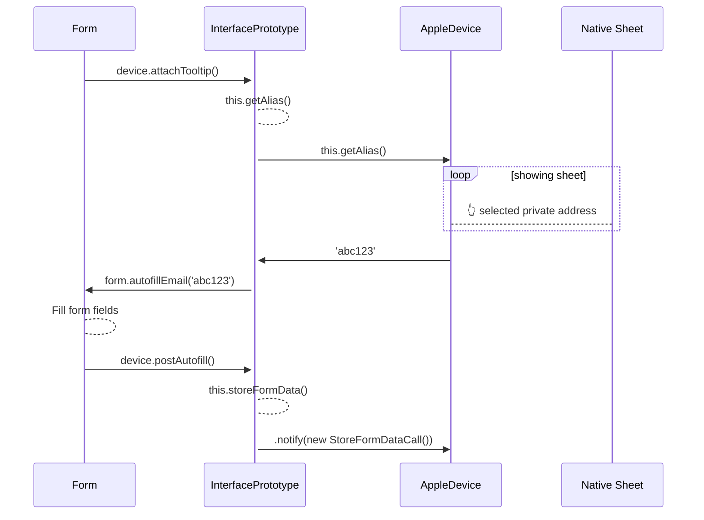

## macOS email alias creation

```mermaid
sequenceDiagram
    Form->>+InterfacePrototype: device.attachTooltip()
    InterfacePrototype->>OverlayController: attach()
    OverlayController->>AppleDevice: options._show()
    AppleDevice->>AppleDevice: deviceApi.notify('showAutofillParent')
    loop polling for click
        AppleDevice-->Overlay: 👆 selected
    end
    AppleDevice->>AppleDevice: Received
    AppleDevice->>InterfacePrototype: selectedDetail()
    InterfacePrototype->>Form: form.autofillData()
    
    InterfacePrototype->>EmailProtection: received('dax@example.com')
    Form-->Form: Fill form fields
    InterfacePrototype-->InterfacePrototype: this.storeFormData()
    InterfacePrototype->>AppleDevice: .notify(new StoreFormDataCall())
```

## iOS email alias

```mermaid
sequenceDiagram
    Form->>+InterfacePrototype: device.attachTooltip()
    InterfacePrototype-->InterfacePrototype: this.getAlias()
    InterfacePrototype->>AppleDevice: this.getAlias()
    loop showing sheet
        AppleDevice-->Native Sheet: 👆 selected private address
    end
    AppleDevice->>InterfacePrototype: 'abc123'
    InterfacePrototype->>Form: form.autofillEmail('abc123')
    Form-->Form: Fill form fields
    Form->>InterfacePrototype: device.postAutofill()
    InterfacePrototype-->InterfacePrototype: this.storeFormData()
    InterfacePrototype->>AppleDevice: .notify(new StoreFormDataCall())
```
