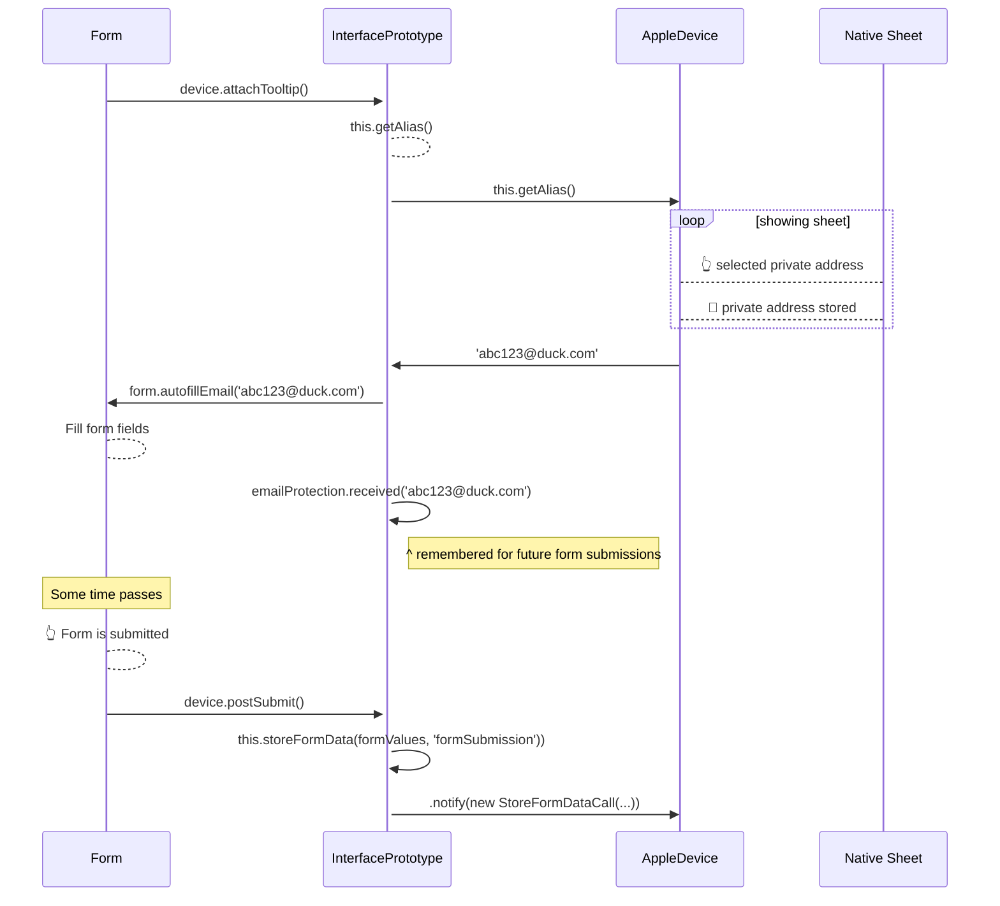

## Email Protection on Mobile

### Using (and saving) a Private Address

For Private Addresses only, we send a `storeFormData` message to the native side to ensure the addresses
are saved.

```mermaid
sequenceDiagram
    Form->>+InterfacePrototype: device.attachTooltip()
    InterfacePrototype-->InterfacePrototype: this.getAlias()
    InterfacePrototype->>AppleDevice: this.getAlias()
    loop showing sheet
        AppleDevice-->Native Sheet: 👆 selected private address
        AppleDevice-->Native Sheet: 💾 private address stored
    end
    AppleDevice->>InterfacePrototype: 'abc123@duck.com'
    InterfacePrototype->>Form: form.autofillEmail('abc123@duck.com')
    Form-->Form: Fill form fields
    InterfacePrototype->>InterfacePrototype: emailProtection.received('abc123@duck.com')
    Note right of InterfacePrototype: ^ remembered for future form submissions
    Note over Form: Some time passes
    Form-->Form: 👆 Form is submitted
    Form->>InterfacePrototype: device.postSubmit()
    InterfacePrototype->>InterfacePrototype: this.storeFormData(formValues, 'formSubmission'))
    InterfacePrototype->>AppleDevice: .notify(new StoreFormDataCall(...))
```
