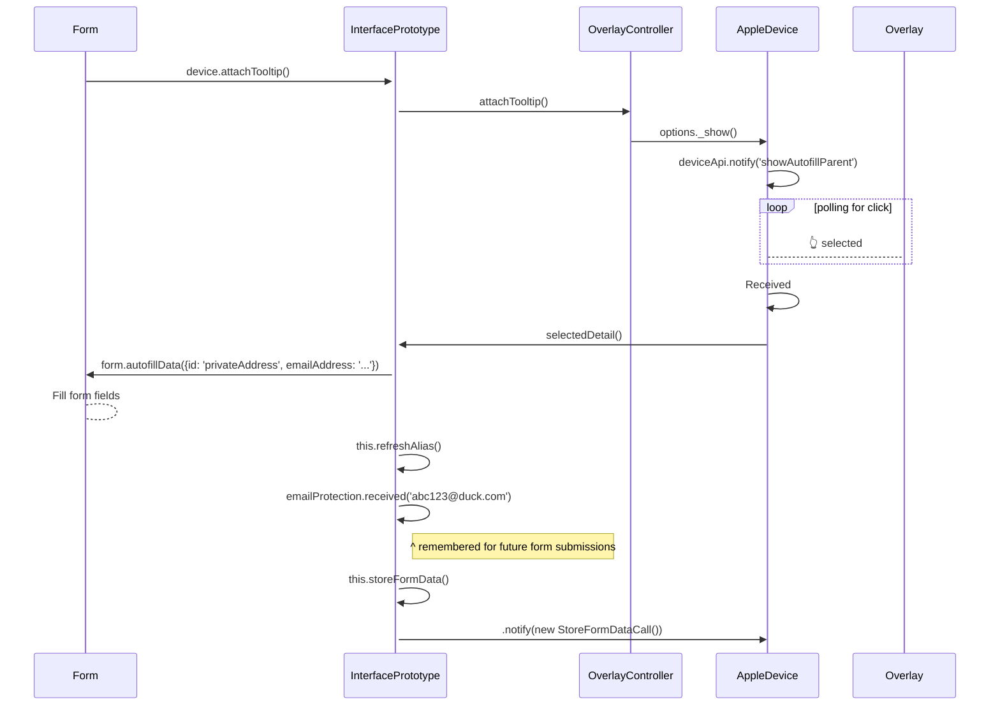

## macOS

Please follow the [iOS Runtime Docs]('./runtime.ios.md) for 
- `getRuntimeConfiguration`
- `getAvailableInputTypes`

---

## Email Protection, `storeFormData(data)`

- See: [../src/deviceApiCalls/schemas/storeFormData.params.json](../src/deviceApiCalls/schemas/storeFormData.params.json)
- Note: Currently, autofill doesn't care/listen for any response here

**request example 1: email protection**

This occurs when a private email was selected. (Not a form submission)...

```json
{
  "credentials": {
    "username": "abc@duck.com",
    "autogenerated": true
  },
  "trigger": "emailProtection"
}
```

...and then the following form submission would look like this:

```json
{
  "credentials": {
    "password": "abcd",
    "username": "0@duck.com",
    "autogenerated": true
  },
  "trigger": "formSubmission"
}
```

If the user changes the email value, then the `autogenerated` flag would be absent, eg:

```json
{
  "credentials": {
    "password": "abcd",
    "username": "dax@example.com"
  },
  "trigger": "formSubmission"
}
```

--- 

## macOS Email Protection flow

For Private Addresses only, we send this `storeFormData` message to the native side to ensure the addresses
are saved.


